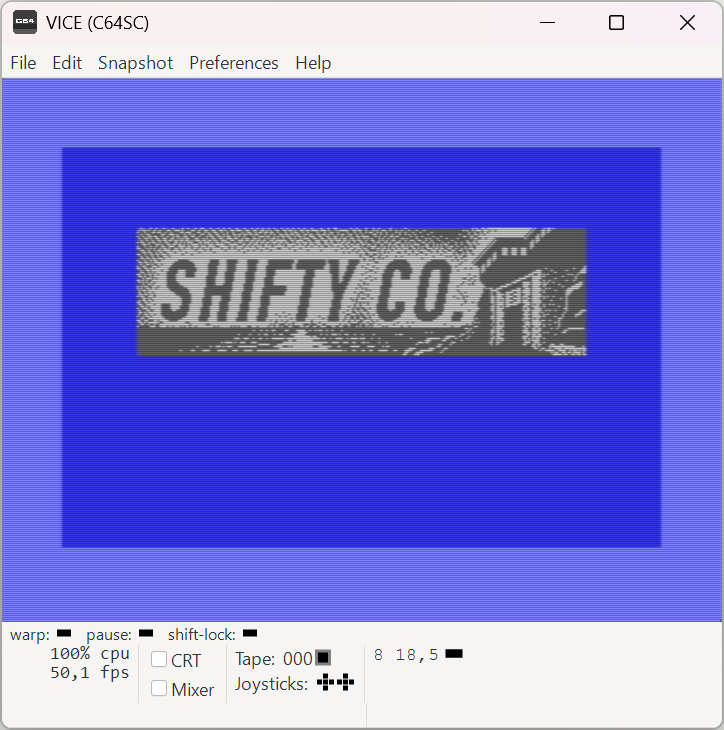
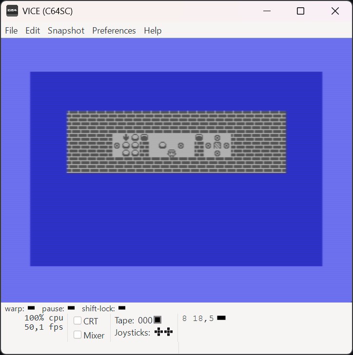

# Shifty64

Small Sokoban-style game in assembly for the Commodore 64. Direct port of the NEC PC-8201A game [Shifty Co](https://github.com/miscellus/Shifty) by [Jakob Kjær-Kammersgaard](https://miscellus.com/).

## The Game
This is a direct port, so the gameplay is described in the Shifty Co repository linked above.

To build this, you'll need to install the ACME assembler. For a more convenient workflow, you'll also want the VICE emulator and Make.

To run it, you attach the D64 disk image and load it with `LOAD"*",8` followed by `RUN`.

## Quirks
This is pretty much an example of how not to make a game for the C64:

- There is no sound or music.
- There are no sprites.
- There are no colors. Only two grays.
- The controls are WASD for movement, Z for undo, R for restarting the current level, and Q for quitting to the title screen. No joystick support at this point.
- Only a small section of the screen is used (to match the NEC PC-8201A original).
- All graphical tiles are 10x8 pixels, which maps terribly to the C64 hardware, so the game runs in hi-res graphics mode. 